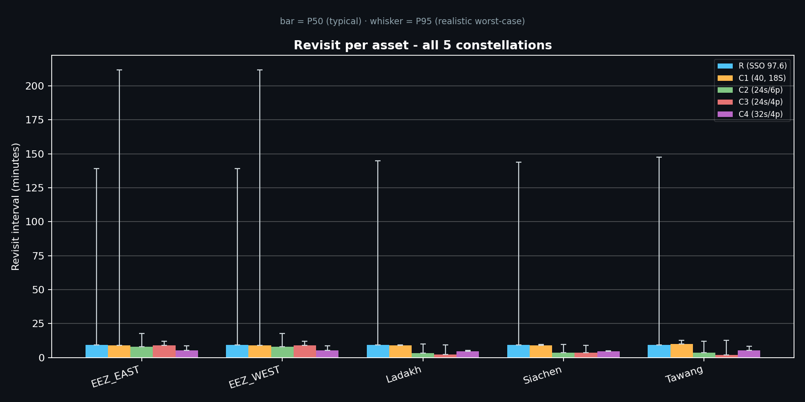
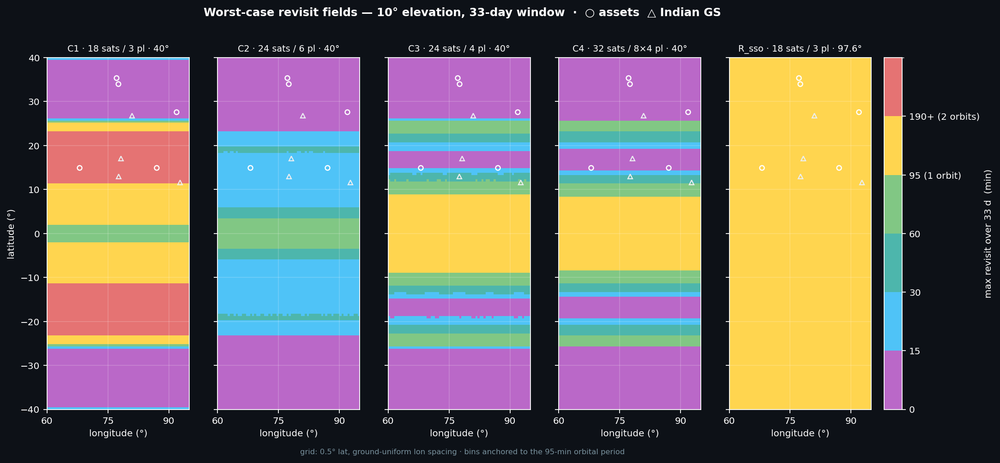
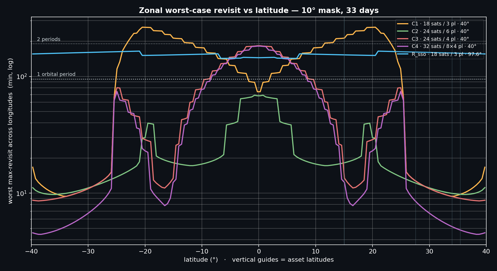
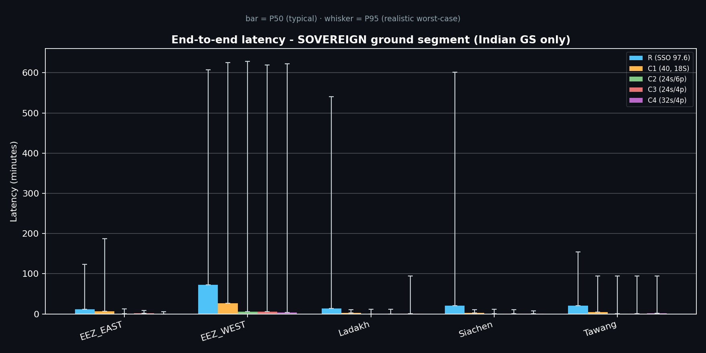
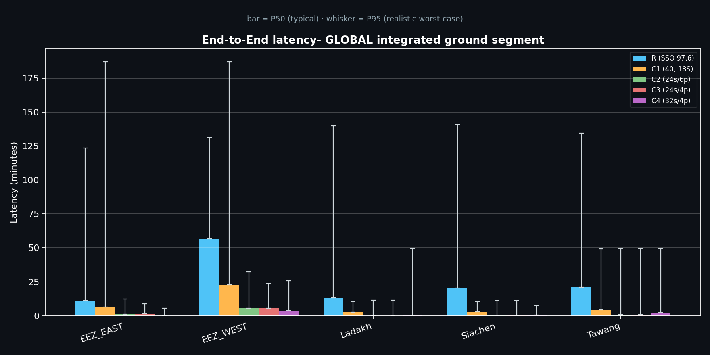
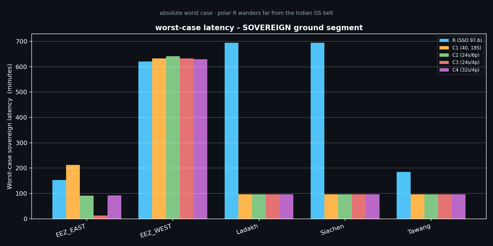
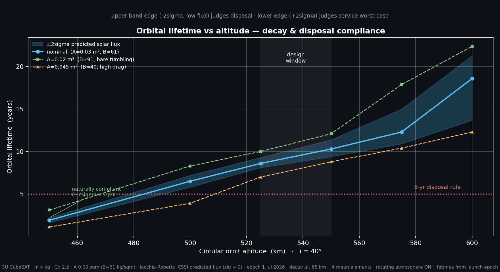
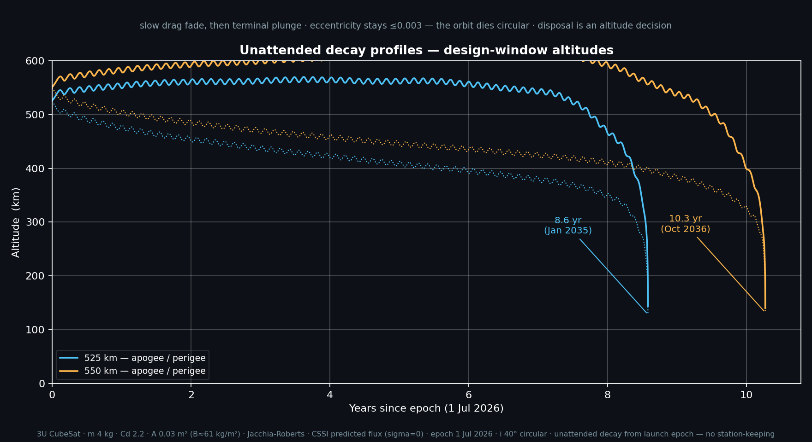
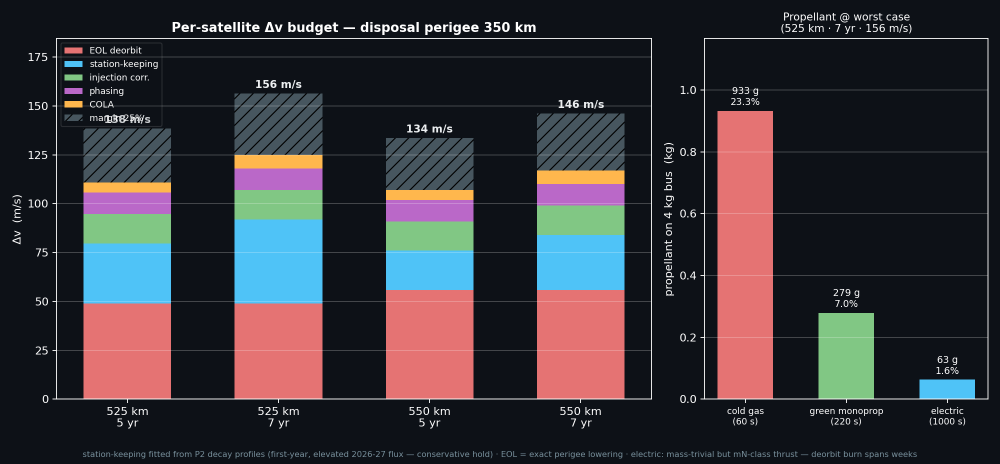
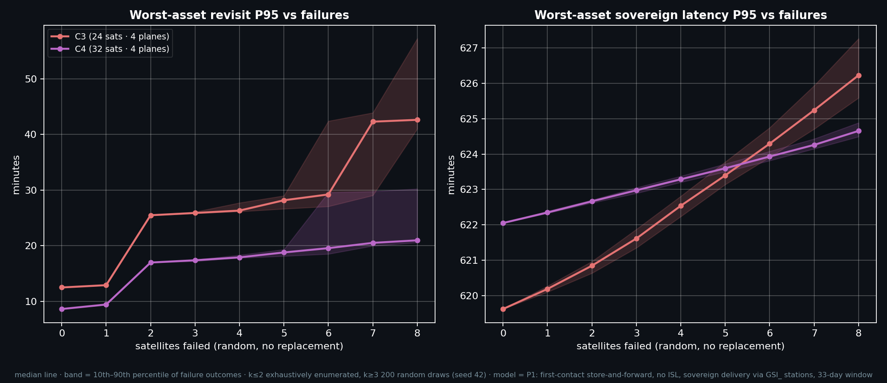

# Sovereign SatCom-IoT Constellation Analysis

**Independent Research: Sovereign SatCom-IoT Connectivity for the Indian Theatre — Maritime EEZ & Northern Border**

This repository contains the end-to-end mission architecture, simulation pipeline, and data analysis for a sovereign space-based satellite-IoT constellation. The study evaluates Walker-Delta configurations for persistent IoT connectivity and data delivery across the Indian theatre — the maritime Exclusive Economic Zone (EEZ) and the northern land borders.

**Tech Stack:** Python 3.11, Systems Tool Kit (STK) 13 Pro, NumPy, Matplotlib, VS Code

---

## Executive Summary

This study evaluates Walker-Delta constellations spanning 18 to 32 satellites, modeled for end-to-end coverage, revisit, store-and-forward latency, orbital lifetime, and propulsion budgets. Every headline metric was cross-verified between STK coverage grids and independent first-principles Python code.

**Core Finding:** A **24-satellite, 4-plane constellation at 525 km / 40°** is the optimal architecture. 
* It holds worst-case revisit under 14 minutes at every strategic asset.
* It beats the denser 6-plane alternative across the maritime EEZ and matches it along the border.
* Scaling past 24 to 32 satellites yields a marginal ~1.3-minute improvement—a launch-cost premium the geography does not repay.
* Deploying a 4-plane design delivers the mission in 4 launches instead of 6, achieving full operational value at two-thirds the deployment cost.

---

## Key Results & Visualizations

The analysis is broken down into four primary operational domains.

### 1. Coverage & Revisit Performance
Inclination is matched to geography, not chosen by default. A 40° orbit dwells at the turning latitude that coincides with the border belt, delivering its tightest revisit exactly where the assets are. 





### 2. End-to-End Latency
Latency was quantified for an India-only Sovereign Ground Segment versus a global integrated network to measure the strict cost of data sovereignty.





### 3. Orbital Dynamics & Propellant Budget
The architecture is stress-tested against end-of-life obligations. Every satellite carries an end-of-life deorbit meeting the 5-year post-mission rule, which is priced into the Δv budget alongside drag station-keeping and collision avoidance.





### 4. System Resilience
Graceful degradation was modeled via Monte Carlo simulation. The first satellite loss is invisible to worst-case revisit; the critical replacement clock starts at the second failure.



---

## Methodology & Pipeline Architecture

This project utilizes a heavily automated, hybrid workflow:
* **Scenario Generation:** STK 13 Pro is driven headlessly via the `ansys.stk.core` Python API to inject Walker-Delta parameters and build ground segments.
* **Data Processing:** Massive access reports and lifetime data (CSVs) are extracted from STK and ingested into Python for first-principles verification.
* **Live Tracking:** `tqdm` progress bars are implemented across all heavy data processing loops to monitor chunk completion and ETAs during constellation generation and access array parsing.
* **Analysis:** NumPy handles vectorised first-contact collections and network latency statistics, while Matplotlib generates the publication-ready charts.

### Repository Structure

```Samtel-Portfolio
├── docs/                               # Study documentation
│   ├── PROJECT_OVERVIEW.md
│   ├── KEY_FINDINGS.md
│   └── TECHNICAL_APPROACH.md
│
├── src/                                # Core execution scripts
│   ├── common/
│   │   └── stk_connect.py              # STK 13 Desktop API initialization
│   ├── 00_build_constellations.py      # Walker-Delta injection & validation
│   └── 03_build_groundstation_setup.py # Ground stations, assets & elevation masks
│
├── analysis/                           # Post-processing and data crunching
│   ├── 01_revisit_latency.py           # Access merging & network latency stats
│   ├── 02_spatial_fom.py               # Revisit heatmaps & zonal structure
│   ├── 03_lifetime_vs_altitude.py      # Solar flux bounding & disposal compliance
│   ├── 04_dv_budget.py                 # Δv budget, plane-acquisition trade & propellant sizing
│   ├── 05_resilience_degradation.py    # Monte Carlo satellite-failure analysis
│   └── 06_decay_profile.py             # Unattended decay visualization
│
├── heatmaps                            # STK revisit heatmaps
│                              
│ 
├── dashboards                          # generated plots and visualizations  
│ 
├── data/                           
│   ├── raw                             # STK exported Reports
│   └── processed                       # Python-computed results
│ 
└── README.md